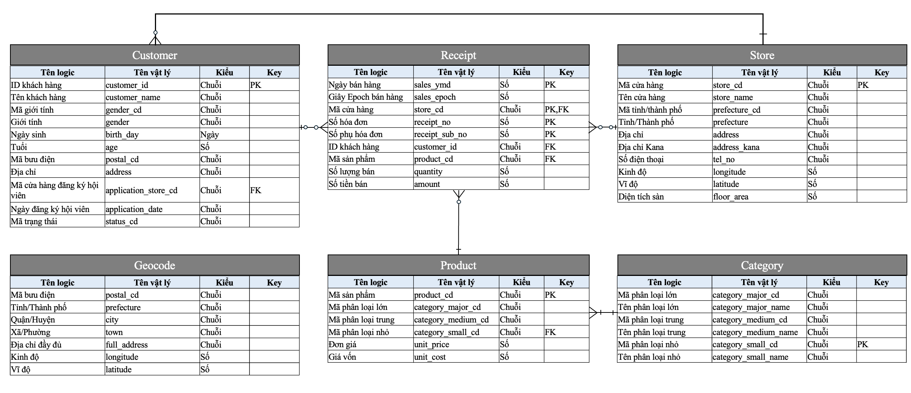

# Cách đọc biểu đồ ER

Biểu đồ ER (Entity-Relationship) trong hình trên mô tả mối quan hệ giữa các thực thể trong hệ thống bán hàng. Đây là một hệ thống dữ liệu lưu trữ thông tin khách hàng, hóa đơn, cửa hàng, sản phẩm, và phân loại sản phẩm.

### Các thực thể và thuộc tính

1. **Customer (Khách hàng)**

   - **customer_id (ID khách hàng)**: Khóa chính (PK), định danh duy nhất cho mỗi khách hàng.
   - **customer_name (Tên khách hàng)**: Tên của khách hàng.
   - **gender_cd (Mã giới tính)** và **gender (Giới tính)**: Thông tin về giới tính.
   - **birth_day (Ngày sinh)**: Ngày sinh của khách hàng.
   - **age (Tuổi)**: Tuổi của khách hàng.
   - **postal_cd (Mã bưu điện)**: Mã bưu điện nơi khách hàng sống.
   - **address (Địa chỉ)**: Địa chỉ cụ thể của khách hàng.
   - **application_store_cd (Mã cửa hàng đăng ký hội viên)**: Mã của cửa hàng nơi khách hàng đăng ký, Foreign Key (FK).
   - **application_date (Ngày đăng ký hội viên)**: Ngày khách hàng đăng ký.
   - **status_cd (Mã trạng thái)**: Trạng thái của khách hàng.

2. **Receipt (Hóa đơn)**

   - **sales_ymd (Ngày bán hàng)**: Ngày bán hàng (PK1).
   - **sales_epoch (Giây Epoch bán hàng)**: Một mã số bán hàng.
   - **store_cd (Mã cửa hàng)**: Mã của cửa hàng bán hàng (PK2, FK).
   - **receipt_no (Số hóa đơn)** và **receipt_sub_no (Số phụ hóa đơn)**: Số hóa đơn và số phụ hóa đơn (PK3, PK4).
   - **customer_id (ID khách hàng)**: ID của khách hàng mua hàng, FK liên kết với Customer.
   - **product_cd (Mã sản phẩm)**: Mã sản phẩm, FK kết với Product.
   - **quantity (Số lượng bán)**: Số lượng sản phẩm bán ra.
   - **amount (Số tiền bán)**: Số tiền thu được từ việc bán hàng.

3. **Store (Cửa hàng)**

   - **store_cd (Mã cửa hàng)**: Mã định danh duy nhất cho cửa hàng (PK).
   - **store_name (Tên cửa hàng)**: Tên cửa hàng.
   - **prefecture_cd (Mã tỉnh/thành phố)** và **prefecture (Tỉnh/Thành phố)**: Thông tin về địa phương.
   - **address (Địa chỉ)** và **address_kana (Địa chỉ Kana)**: Địa chỉ của cửa hàng.
   - **tel_no (Số điện thoại)**: Số điện thoại của cửa hàng.
   - **longitude (Kinh độ)** và **latitude (Vĩ độ)**: Tọa độ địa lý của cửa hàng.
   - **floor_area (Diện tích sàn)**: Diện tích sàn của cửa hàng.

4. **Geocode**

   - **postal_cd (Mã bưu điện)**: Mã bưu điện.
   - **prefecture (Tỉnh/Thành phố)**: Thông tin về tỉnh/thành phố.
   - **city (Quận/Huyện)**: Thông tin về quận/huyện.
   - **town (Xã/Phường)**: Thông tin về xã/phường.
   - **full_address (Địa chỉ đầy đủ)**: Địa chỉ đầy đủ.
   - **longitude (Kinh độ)** và **latitude (Vĩ độ)**: Tọa độ địa lý.

5. **Product (Sản phẩm)**

   - **product_cd (Mã sản phẩm)**: Mã định danh duy nhất cho sản phẩm (PK).
   - **category_major_cd (Mã phân loại lớn)**, **category_medium_cd (Mã phân loại trung)**, **category_small_cd (Mã phân loại nhỏ) -FK**: Mã phân loại sản phẩm theo các cấp độ.
   - **unit_price (Đơn giá)**: Giá bán lẻ của sản phẩm.
   - **unit_cost (Giá vốn)**: Giá vốn của sản phẩm.

6. **Category (Phân loại sản phẩm)**
   - **category_major_cd (Mã phân loại lớn)**: Mã phân loại lớn.
   - **category_major_name (Tên phân loại lớn)**: Tên của phân loại lớn.
   - **category_medium_cd (Mã phân loại trung)**: Mã phân loại trung.
   - **category_medium_name (Tên phân loại trung)**: Tên của phân loại trung.
   - **category_small_cd (Mã phân loại nhỏ)**: Mã phân loại nhỏ (PK).
   - **category_small_name (Tên phân loại nhỏ)**: Tên của phân loại nhỏ.

### Primary Key và Foreign Key

- **PK (Primary Key):** Khóa chính, là một thuộc tính hoặc tập hợp các thuộc tính để định danh duy nhất mỗi bản ghi trong một thực thể.

  - Ví dụ: `customer_id` trong thực thể `Customer` là khóa chính.

- **FK (Foreign Key):** Khóa ngoại, là một thuộc tính hoặc tập hợp các thuộc tính trong một thực thể này tham chiếu đến khóa chính của một thực thể khác.
  - Ví dụ: `customer_id` trong thực thể `Receipt` là khóa ngoại tham chiếu đến `customer_id` trong thực thể `Customer`.

### Mối quan hệ giữa các thực thể

- **Store - Customer:**: Một cửa hàng có nhiều khách hàng (quan hệ 1-n). `application_store_cd` trong `Customer` là FK tham chiếu đến `store_cd` trong `store`
- **Customer - Receipt:** Một khách hàng có thể có nhiều hóa đơn (quan hệ 1-n). `customer_id` trong `Receipt` là khóa ngoại tham chiếu đến `customer_id` trong `Customer`.
- **Store - Receipt:** Một cửa hàng có thể có nhiều hóa đơn (quan hệ 1-n). `store_cd` trong `Receipt` là khóa ngoại tham chiếu đến `store_cd` trong `Store`.
- **Receipt - Product:** Một hóa đơn có thể có nhiều sản phẩm (quan hệ 1-n). `product_cd` trong `Receipt` là khóa ngoại tham chiếu đến `product_cd` trong `Product`.
- **Product - Category:** Một sản phẩm thuộc về một danh mục (quan hệ n-1). `category_small_cd` trong `Product` là khóa ngoại tham chiếu đến `category_small_cd` trong `Category`.

### Tóm tắt

Biểu đồ ER này thiết kế để quản lý thông tin khách hàng, hóa đơn, cửa hàng, sản phẩm, và phân loại sản phẩm một cách có tổ chức và dễ dàng truy xuất. Mỗi thực thể có các thuộc tính chi tiết để lưu trữ thông tin cần thiết và các mối quan hệ giữa các thực thể giúp đảm bảo tính toàn vẹn dữ liệu.
